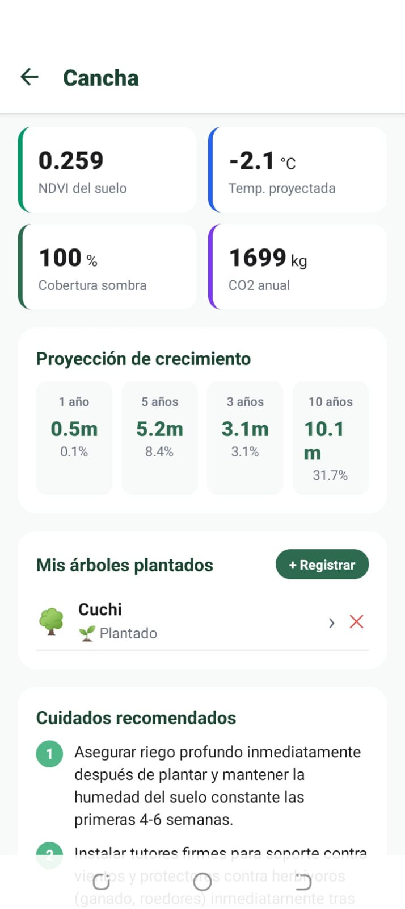
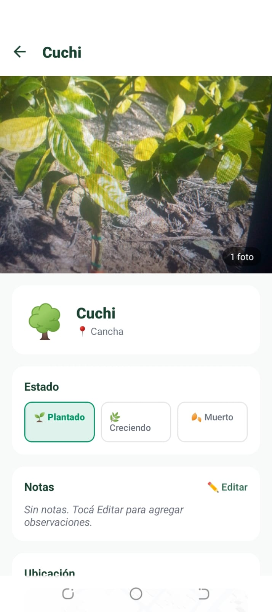
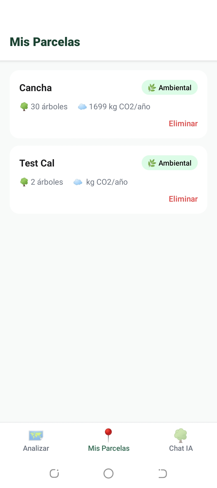
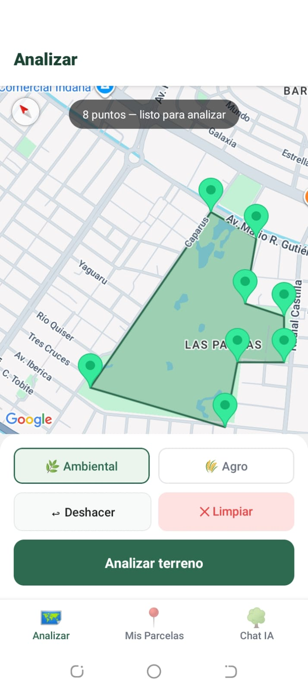
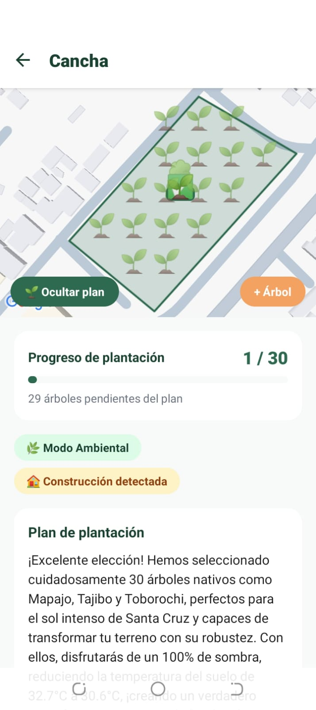
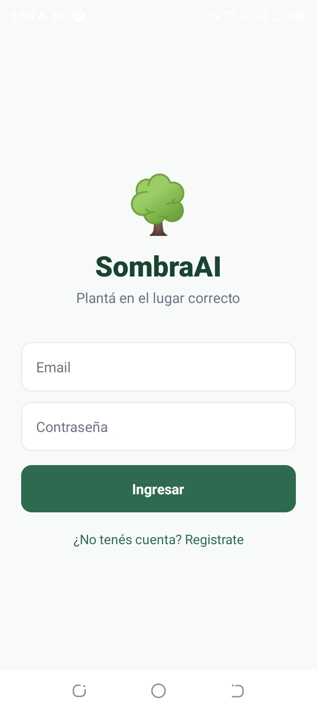

# SombraAI 🌳

> Plataforma de recomendación inteligente para planificar plantación de arboles nativos y ayudar con la reforestación provocada por los incendios en Santa Cruz.

SombraAI permite a cualquier persona con un terreno analizar su parcela desde el celular, recibir puntos estratégicos de plantación calculados por satélite e IA, hacer seguimiento a los árboles plantados y consultar un asistente agronómico por texto o voz.

---

## Equipo AIScorpio

| # | Nombre  |
|---|-------------|
| 1 | Rosales Velasco Adrian B. |
| 2 | Vasquez Flores Josue |
| 3 | Chacón Vidal Carla Nicol |
| 4 | Marañon Hurtado Rosa Andrea |
| 5 | _(pendiente PR)_  |

## Repositorios

| Repo | Descripción |
|------|-------------|
| **Backend** (este repo) | API FastAPI + Google Cloud |
| **Frontend** | [aldaxho/hakatatonFron](https://github.com/aldaxho/hakatatonFron) — App móvil React Native / Expo |

---

## Documentación

| Archivo | Descripción |
|---------|-------------|
| [Documentacion.pdf](docs/SombraIA...pdf) | Documento técnico del proyecto |
| [Presentacion.pptx](docs/SombraIA_presentacion.pptx) | PowerPoint de presentación |

---

## Descripción general

SombraAI tiene dos modos de análisis:

**Modo ambiental** — para cualquier persona con terreno que quiera generar sombra, capturar CO₂ o reforestar. Los árboles se distribuyen dentro del terreno maximizando cobertura. Incluye proyección de crecimiento a 1, 3, 5 y 10 años.

**Modo agro** — para agricultores. Los árboles se colocan en los bordes del campo como cortinas rompevientos, sin competir con el cultivo.

Características adicionales:
- **Detección de zona quemada** vía MODIS: adapta automáticamente las recomendaciones a recuperación post-incendio.
- **Detección de construcciones** vía NDBI (Sentinel-2): alerta si el terreno tiene infraestructura.
- **Seguimiento de árboles**: el usuario registra cada árbol plantado con foto, GPS y notas.
- **Chat agronómico**: asistente con contexto de la parcela, disponible por texto y voz.
- **Calendario de plantación**: generado por especie y municipio.

---

## Arquitectura

```
┌─────────────────────────────────────────────────────────────┐
│                     App móvil (Expo)                        │
│  Análisis  │  Parcelas  │  Árboles  │  Chat voz/texto       │
└────────────────────────┬────────────────────────────────────┘
                         │ HTTPS + Firebase ID Token
                         ▼
┌─────────────────────────────────────────────────────────────┐
│                  FastAPI — Cloud Run                        │
│                                                             │
│  /analizar     /parcelas     /arboles    /chat    /voz      │
│      │               │                    │         │       │
│      ▼               ▼                    ▼         ▼       │
│  motor.py       Firestore             Firestore   Gemini    │
│  (EE + pvlib)                       + Storage   STT / TTS   │
└─────────────────────────────────────────────────────────────┘
         │                                     │
         ▼                                     ▼
  Google Earth Engine              Google Cloud Speech / TTS
  Sentinel-2, MODIS
```

**Flujo principal:**
1. El usuario dibuja un polígono sobre el mapa en la app.
2. El backend consulta Google Earth Engine (NDVI, LST, NDBI, zonas quemadas).
3. Gemini genera la recomendación de especies y cuidados.
4. Los puntos de plantación se calculan geométricamente (grid o borde según modo).
5. El resultado se guarda en Firestore vinculado a la parcela del usuario.
6. El usuario registra árboles, agrega fotos (Firebase Storage) y consulta al chat.

---

## Tecnologías

| Capa | Tecnología |
|------|-----------|
| App móvil | React Native · Expo SDK 56 · react-native-maps |
| Backend | Python 3.11 · FastAPI · Uvicorn |
| Despliegue | Google Cloud Run |
| Satélite | Google Earth Engine (Sentinel-2 NDVI/NDBI, MODIS Fire/LST) |
| Radiación solar | pvlib |
| IA generativa | Gemini 2.5 Flash (Google AI Studio) |
| Voz STT | Google Cloud Speech-to-Text |
| Voz TTS | Google Cloud Text-to-Speech |
| Base de datos | Cloud Firestore |
| Almacenamiento | Firebase Storage |
| Autenticación | Firebase Authentication |
| Geometría | Shapely |

---

## Imágenes referenciales

<table>
  <tr>
    <td align="center"><br/><sub>Pantalla 1</sub></td>
    <td align="center"><br/><sub>Pantalla 2</sub></td>
    <td align="center"><br/><sub>Pantalla 3</sub></td>
  </tr>
  <tr>
    <td align="center"><br/><sub>Pantalla 4</sub></td>
    <td align="center"><br/><sub>Pantalla 5</sub></td>
    <td align="center"><br/><sub>Pantalla 6</sub></td>
  </tr>
</table>

---

## Instrucciones de ejecución

### Requisitos previos

- Python 3.11+
- Cuenta de Google Cloud con los siguientes servicios habilitados:
  - Cloud Firestore API
  - Earth Engine API
  - Cloud Resource Manager API
  - Cloud Speech-to-Text API
  - Cloud Text-to-Speech API
  - Firebase Storage

### 1. Clonar e instalar dependencias

```bash
git clone <este-repo>
cd SombraAI

python -m venv venv
# Windows:
venv\Scripts\activate
# Linux / macOS:
source venv/bin/activate

pip install -r requirements.txt
```

### 2. Configurar variables de entorno

```bash
cp .env.example .env
```

Editar `.env`:

| Variable | Descripción |
|----------|-------------|
| `GOOGLE_CLOUD_PROJECT` | ID del proyecto GCP |
| `GOOGLE_APPLICATION_CREDENTIALS` | Ruta al `serviceAccountKey.json` |
| `FIRESTORE_DATABASE_ID` | ID de la base Firestore (usar `(default)`) |
| `GEMINI_API_KEY` | API key de Google AI Studio |
| `ENV` | `development` desactiva verificación de token Firebase |

### 3. Credenciales

| Archivo | Cómo obtenerlo |
|---------|----------------|
| `serviceAccountKey.json` | GCP Console → IAM → Cuentas de servicio → Claves JSON |
| `GEMINI_API_KEY` | [aistudio.google.com/app/apikey](https://aistudio.google.com/app/apikey) |
| `google-services.json` | Firebase Console → Configuración del proyecto → Android |

**Rol mínimo de la cuenta de servicio:** Editor (cubre Firestore + Earth Engine).

**Registro en Earth Engine:** el proyecto debe registrarse en [code.earthengine.google.com](https://code.earthengine.google.com) → *Register a Cloud Project*.

### 4. Ejecutar localmente

```bash
venv\Scripts\uvicorn main:app --port 8080 --reload
```

La API queda disponible en `http://localhost:8080/api`.
Endpoint de salud: `GET /api/health`.

### 5. Despliegue en Cloud Run

```bash
gcloud run deploy sombraai \
  --source . \
  --region us-central1 \
  --allow-unauthenticated
```

---

## Licencia

MIT — Hackathon 2025
